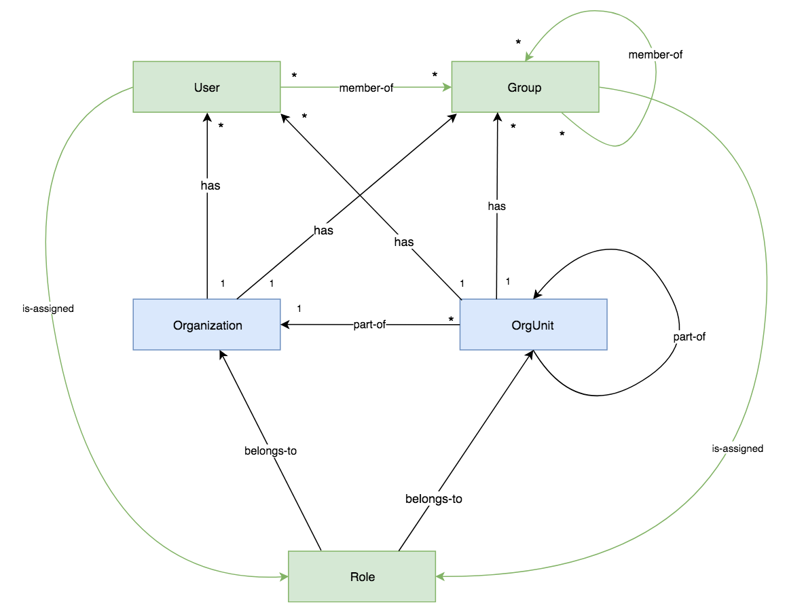

# User

A user is a member of 0+ `Groups`. A user has explicit roles assigned directly, and implicit roles propagated from groups.

A user can be a part of an organizational structure and may, therefore, belong to either `OrgUnit` or `Organization`.

# Group

A group of users and groups. A group has explicit roles assigned directly (they're propagated further), and implicit roles propagated from parent groups. 

A group can be a part of an organizational structure and may, therefore, belong to either `OrgUnit` or `Organization`.

# OrgUnit

An organizational unit. An organizational unit must be a part of `Organization` or a larger `OrgUnit`.

# Organization

An organization is a root of the organizational structure of the customer. An organization is associated with the tenant.

# Role

A role belongs either to `Organization` or `OrgUnit` and can be assigned to users and groups from that unit.
